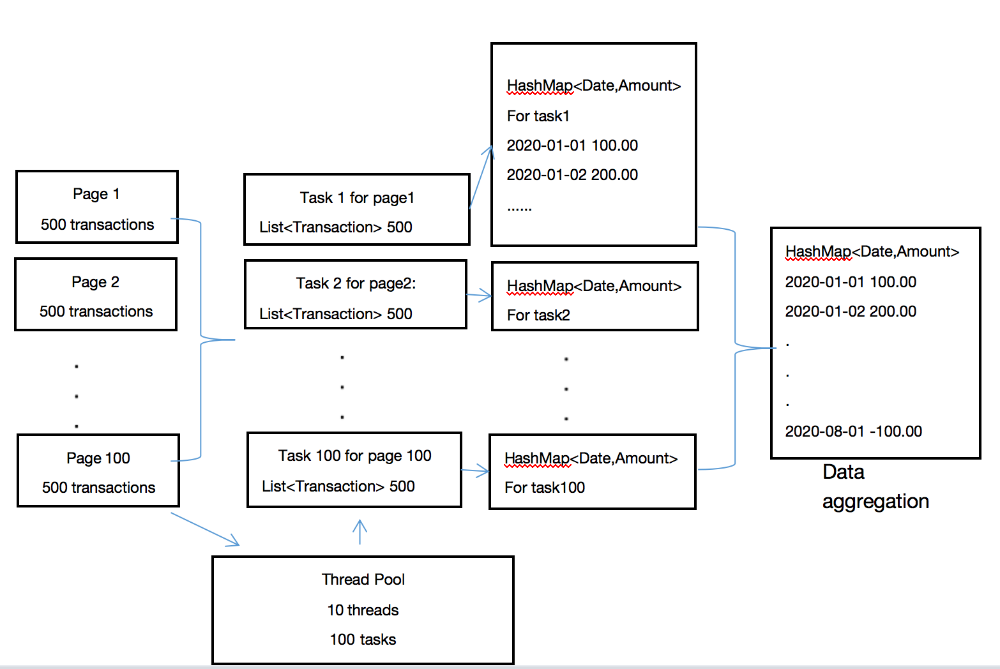
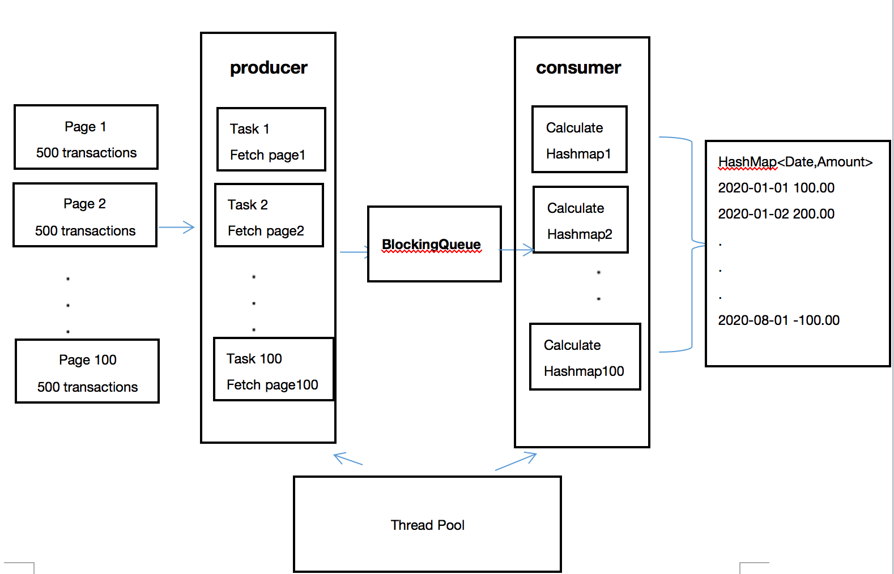

# restTest Bench

This program is a java application for resolving [restTest Bench](https://resttest.bench.co/).
It fetches all transactions from a REST API and calculates running daily balances and prints them to the console. 

## Getting Started

### Dependencies

* JDK 1.8
* fastjson-1.2.18
* Junit 4

### Run it

You need to install JDK 1.8+, check out the repository and run
```
java -jar [your project path]/RestTestBenchAccounting/RestTest.jar
```

You can also run it with optional arguments:
`-debug`, print debug log;
`-thread 5`, assign the thread number to call REST API simultaneously according to server's throughput;

## How it works

1. It uses the standard `HttpURLConnection` to make a HTTP GET request and deal with the response accordingly.
1. It makes a call to get the first page and calculate the total page number according to the `totalCount` in the return. 
1. It then initiates a fixed thread pool to fetch all the pages concurrently. The number of the threads is based on the page number we calculated above and the throughput of the server. We want to make the most use of multi-thread but not go above the threshold limit of the server. The sub-thread will be assigned a task to fetch one page of the transactions, and pre-calculate them within the thread.
1. After each of the threads is done, it merges its data into a single collection. It uses feature.get() to block the main thread and wait for the sub thread, then does the merge before checking the next thread, which makes sure the operation of one collection is thread safe.
1. Lastly, it aggregates all the transactions, by sorting them and then calculating the running daily balances. The result is printed to the console.

[](images/solution.png)


## Limitations and trade-offs

### Works better for large data
As opposed to a single thread, we introduced a thread pool and tried to improve the efficiency by calling the API and dealing with the response concurrently. Since creating and maintaining a thread pool also costs resources and time, if the transaction is very small, say only one page, then it does not make sense to having a pool to deal with one API call.
But in real-world, we expect that there will be various possibilities from different users, so this model should work better for most of the time.   

### Pre-calculate within the thread and merge
After fetching of each page, we want to deal with the data more effectively. An approach was considered to do the calculation and merge on the run, and operate a single collection as the final result. Concurrent collection provided by java could be used here to guarantee thread safe when operating one collection by multi-thread. However if the page data is large, there is a reasonable risk of having conflicts even using concurrent collection if same segment is touched, which makes it less efficient.
We do the pre-calculation for each page within the thread handling it, and then merge all the result afterwards. It leverages each thread the most and avoid operation conflicts.

### HTTP response handling
Here we only make a simple HTTP response handling by accepting 200 response, logging and abandoning other abnormal responses. Ideally we could introduce some retry logic to handle transient server-end error like timeout. But we didn't do that due to time limitation. 

### Waiting for each thread
We use a loop to check each thread's readiness with feature.get(), it blocks the main thread on the sub-thread it is waiting for. Sometimes, other threads might end earlier but still have to wait to be reached in the loop, which is a time waste.
We considered using producer-consumer pattern to improve this situation. The solution is described below, we could have implemented it if we have more time.

[](images/producer-consumer-model.png)


